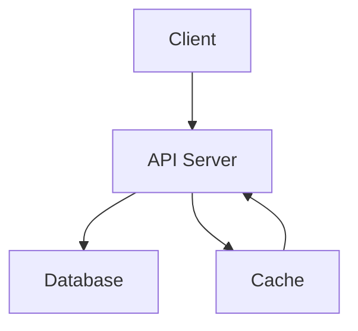
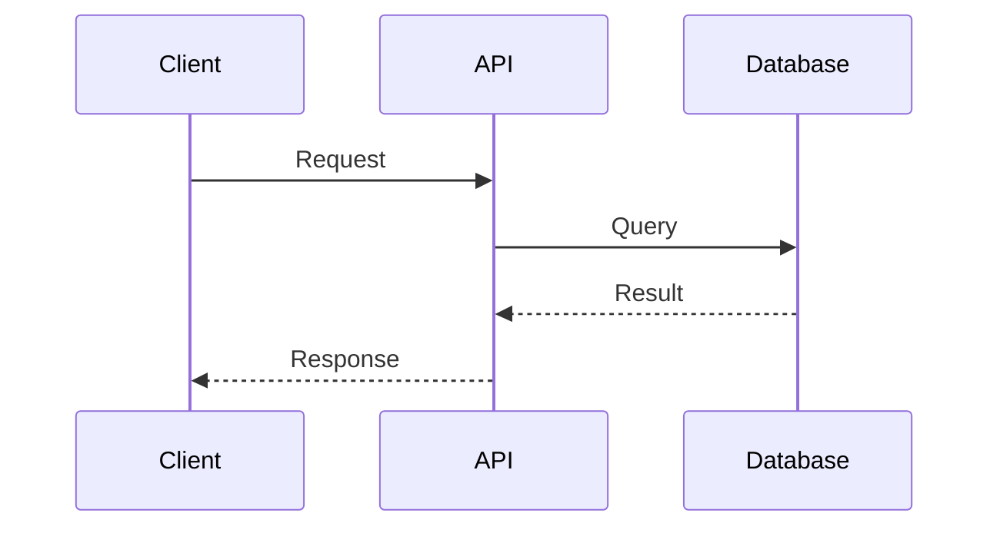

# Architecture

> High-level architecture of this project. Keep this document updated as the system evolves.

<!-- TODO: Brief system description -->

## System Diagram

<!-- TODO: Replace with your system's architecture -->

## Key Components

| Component | Purpose | Location |
|-----------|---------|----------|
| <!-- TODO --> | | |

## Data Flow

<!-- TODO: Describe how data moves through the system -->

## Technology Choices

| Decision | Choice | Rationale |
|----------|--------|-----------|
| <!-- TODO: e.g., Language --> | <!-- e.g., TypeScript --> | <!-- e.g., Type safety, ecosystem --> |
| <!-- TODO: e.g., Database --> | <!-- e.g., PostgreSQL --> | <!-- e.g., Relational, ACID --> |
| <!-- TODO: e.g., Hosting --> | <!-- e.g., Railway --> | <!-- e.g., Simple deploys, good DX --> |

## Constraints

<!-- TODO: What constraints affect the architecture? -->

- **Performance:** <!-- e.g., <200ms p99 latency -->
- **Security:** <!-- e.g., SOC2 compliance required -->
- **Budget:** <!-- e.g., <$50/month infrastructure -->
- **Team:** <!-- e.g., Solo developer, async-first -->

## Architecture Decision Records

See [docs/decisions/](decisions/) for detailed ADRs.

| ADR | Date | Decision | Status |
|-----|------|----------|--------|
| [000](decisions/000-template.md) | — | Template | — |

---

> [!NOTE]
> Keep this document in sync with the codebase. Review during major changes.

See also: [README.md](../README.md) | [CLAUDE.md](../CLAUDE.md) | [decisions/](decisions/)
