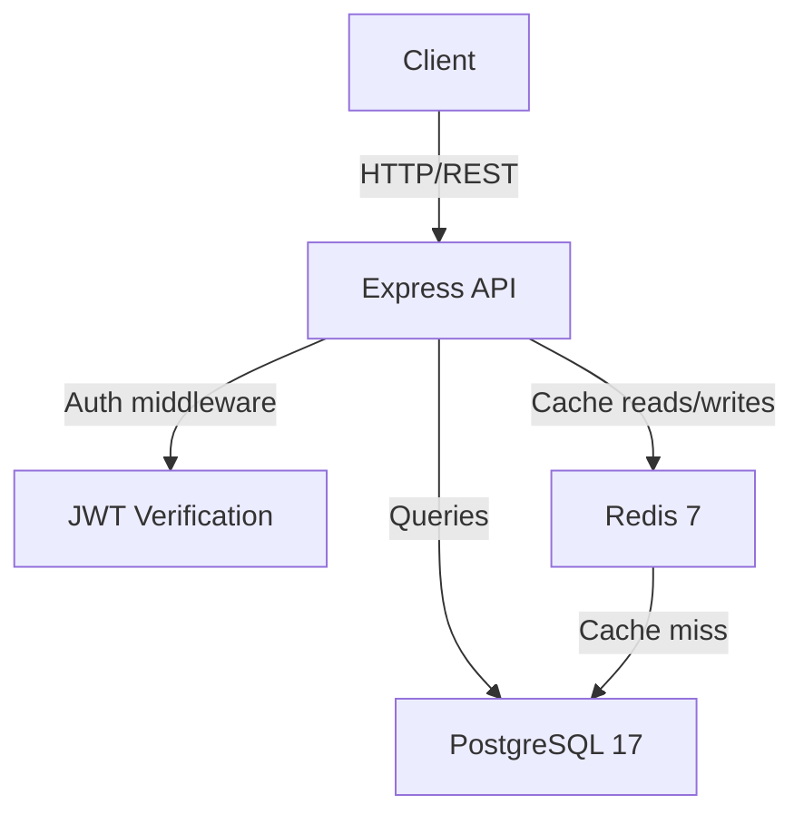
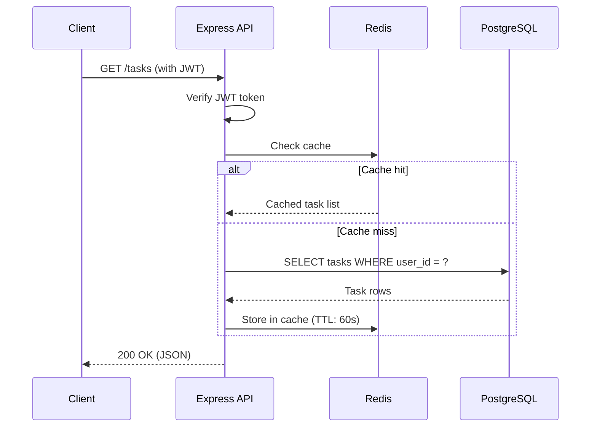

# Architecture

> High-level architecture of task-api. Keep this document updated as the system evolves.

task-api is a REST API for task management built with Express 5, PostgreSQL, and Redis. It provides CRUD operations on tasks, JWT-based authentication, and Redis caching for frequently accessed data.

## System Diagram

## Key Components

| Component | Purpose | Location |
|-----------|---------|----------|
| Express server | HTTP request handling, routing | `src/index.ts` |
| Route handlers | Endpoint logic for tasks, auth, health | `src/routes/` |
| Auth middleware | JWT token verification, user context | `src/middleware/` |
| Validation middleware | Zod schema validation for request bodies | `src/middleware/` |
| Task model | PostgreSQL queries for tasks table | `src/models/` |
| Auth service | User registration, login, token generation | `src/services/` |
| Task service | Business logic for task operations | `src/services/` |

## Data Flow

## Technology Choices

| Decision | Choice | Rationale |
|----------|--------|-----------|
| Language | TypeScript | Type safety, better DX, catches errors at compile time |
| Runtime | Node.js 22 | Native ESM, performance improvements, LTS |
| Framework | Express 5 | Async middleware support, massive ecosystem, team familiarity |
| Database | PostgreSQL 17 | Relational data (tasks, users), ACID compliance, JSON support |
| Cache | Redis 7 | Sub-millisecond reads, built-in TTL, pub/sub for future real-time features |
| Validation | Zod | TypeScript-native, inferred types, composable schemas |
| Auth | JWT (jsonwebtoken) | Stateless authentication, simple client integration |
| Testing | Vitest | Fast, TypeScript-native, compatible with Jest API |

## Constraints

- **Performance:** < 100ms p95 latency for cached endpoints
- **Security:** JWT tokens with short expiry, bcrypt password hashing
- **Budget:** Single-server deployment initially, horizontal scaling later
- **Team:** Solo developer, async-first workflow

## Architecture Decision Records

See [docs/decisions/](decisions/) for detailed ADRs.

| ADR | Date | Decision | Status |
|-----|------|----------|--------|
| [000](decisions/000-template.md) | --- | Template | --- |

---

> [!NOTE]
> Keep this document in sync with the codebase. Review during major changes.

See also: [README.md](../README.md) | [CLAUDE.md](../CLAUDE.md) | [decisions/](decisions/)
