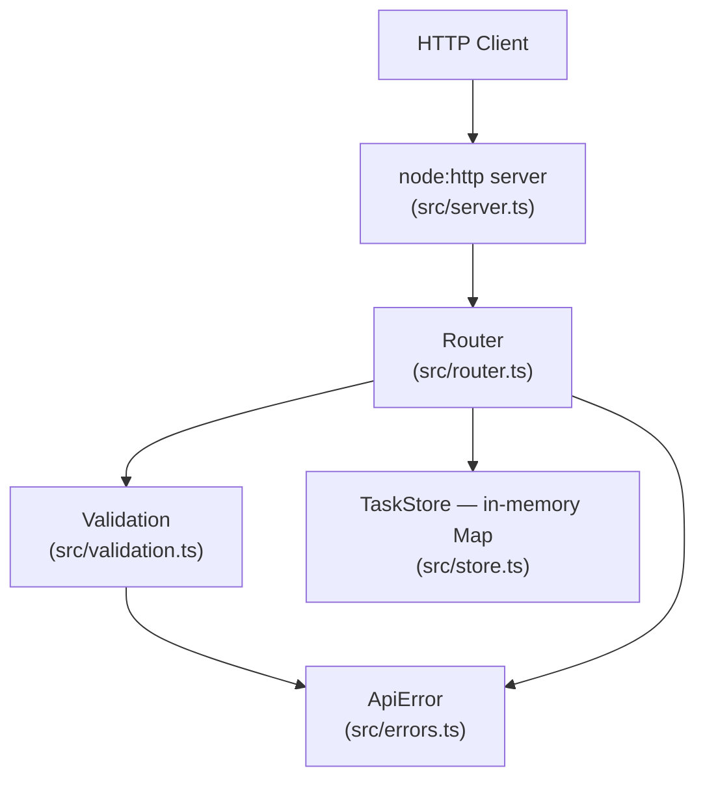

# Architecture

> System architecture for **task-api**, the example project built from
> [vbonk/repo-template](https://github.com/vbonk/repo-template) v2.0.0.

## Overview

task-api is a small task-management REST API served over Node's built-in `node:http` module — no web framework, no database, zero runtime dependencies. Requests flow through a hand-rolled router, payloads are validated into typed shapes, and tasks live in an in-memory `Map`. The app is intentionally minimal: this repository's purpose is to demonstrate the template's repository engineering, and a small app keeps that legible.

## System Diagram

```mermaid
graph TD
    A[HTTP Client] --> B["node:http server<br/>(src/server.ts)"]
    B --> C["Router<br/>(src/router.ts)"]
    C --> D["Validation<br/>(src/validation.ts)"]
    C --> E["TaskStore — in-memory Map<br/>(src/store.ts)"]
    D --> F["ApiError<br/>(src/errors.ts)"]
    C --> F
```

## Components

| Component | File | Responsibility |
|-----------|------|----------------|
| Entry point | `src/index.ts` | Reads `PORT`/`HOST`, starts the server, graceful shutdown on SIGINT/SIGTERM |
| HTTP server | `src/server.ts` | Reads/limits JSON bodies, dispatches to the router, maps `ApiError` to JSON responses |
| Router | `src/router.ts` | Matches method + path (`/health`, `/tasks`, `/tasks/:id`), returns `{status, body}` |
| Validation | `src/validation.ts` | Parses unknown payloads into typed create/update shapes with per-field issues |
| Store | `src/store.ts` | `TaskStore` — CRUD over a `Map<string, Task>`, status filtering, UUID ids |
| Errors | `src/errors.ts` | `ApiError` (status + code + optional details) and helper constructors |
| Types | `src/types.ts` | `Task`, `TaskStatus`, request payload types |

## Data Flow

1. `server.ts` receives a request, enforces a JSON body size limit, and parses the body (invalid JSON → `400`).
2. `router.ts` matches the route. Unknown paths → `404`; known paths with wrong methods → `405` with an `Allow` header.
3. Write routes call `validation.ts`, which either returns a typed payload or throws an `ApiError` carrying per-field issues.
4. The route handler calls `TaskStore`; missing ids → `404`.
5. The handler's `{status, body}` is serialized as JSON. `ApiError` becomes `{error: {code, message, details?}}`; anything unexpected becomes a generic `500` (details are logged server-side only).

## Technology Choices

| Choice | Selection | Rationale |
|--------|-----------|-----------|
| Language | TypeScript (strict, ESM) | Type safety; the template's primary showcased stack |
| Runtime | Node.js 22 (`.nvmrc`) | Current LTS line; matches CI |
| HTTP layer | `node:http`, no framework | Zero runtime dependencies — see [ADR-006](decisions/006-zero-runtime-dependencies.md) |
| Storage | In-memory `Map` | Example scope; tests run anywhere with no services |
| Testing | Vitest + V8 coverage | Fast ESM-native runner; 80% thresholds enforced in CI |
| Linting | ESLint 9 flat config + typescript-eslint | Extends the template's `templates/linting/eslint.config.mjs.template` |

## Constraints

- **No persistence.** Tasks are lost on restart. Accepted for example scope and documented in the README; a real service would swap `TaskStore` for a database-backed implementation behind the same interface.
- **No authentication.** The API is anonymous. A real service would add an auth layer in `server.ts` before routing.
- **Single process.** No horizontal scaling story — state is process-local by design.

## Architecture Decision Records

| ADR | Decision | Origin |
|-----|----------|--------|
| [001](decisions/001-sha-pinned-actions.md) | SHA-pinned GitHub Actions | Inherited from template |
| [002](decisions/002-rulesets-over-classic-protection.md) | Rulesets over classic branch protection | Inherited from template |
| [003](decisions/003-skills-directory-format.md) | Skills as `<name>/SKILL.md` directories | Inherited from template |
| [004](decisions/004-two-agent-focus.md) | Two-agent focus (Claude Code + Codex) | Inherited from template |
| [005](decisions/005-drift-severity-and-fail-closed.md) | Drift severity + fail-closed validation | Inherited from template |
| [006](decisions/006-zero-runtime-dependencies.md) | Zero runtime dependencies + in-memory store | This project |

New decisions: copy [decisions/000-template.md](decisions/000-template.md).
